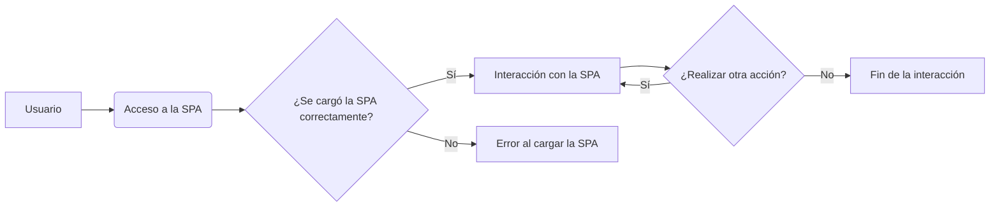

```mermaid
graph LR
    A[Usuario] --> B(Acceso a la SPA)
    B --> C{¿Se cargó la SPA correctamente?}
    C -->|Sí| D[Interacción con la SPA]
    D --> E{¿Realizar otra acción?}
    E -->|Sí| D
    E -->|No| F[Fin de la interacción]
    C -->|No| G[Error al cargar la SPA]

```
