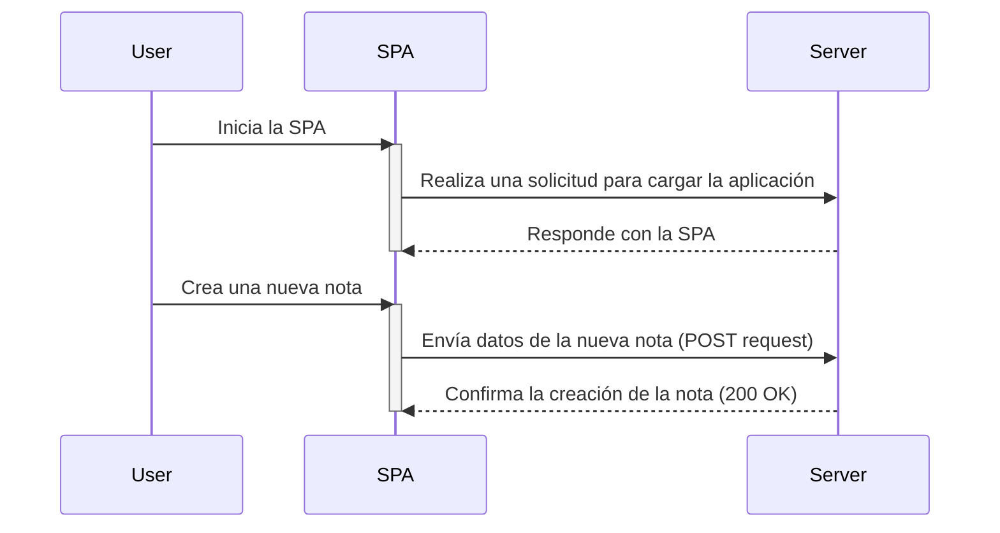

```mermaid
sequenceDiagram
    participant User
    participant SPA
    participant Server

    User->>SPA: Inicia la SPA
    activate SPA
    SPA->>Server: Realiza una solicitud para cargar la aplicación
    Server-->>SPA: Responde con la SPA
    deactivate SPA

    User->>SPA: Crea una nueva nota
    activate SPA
    SPA->>Server: Envía datos de la nueva nota (POST request)
    Server-->>SPA: Confirma la creación de la nota (200 OK)
    deactivate SPA
```
