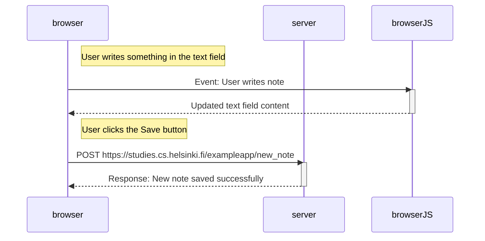

```mermaid
sequenceDiagram
    participant browser
    participant server
    participant browserJS

    Note right of browser: User writes something in the text field

    browser->>browserJS: Event: User writes note
    activate browserJS
    browserJS-->>browser: Updated text field content
    deactivate browserJS

    Note right of browser: User clicks the Save button

    browser->>server: POST https://studies.cs.helsinki.fi/exampleapp/new_note
    activate server
    server-->>browser: Response: New note saved successfully
    deactivate server

```
